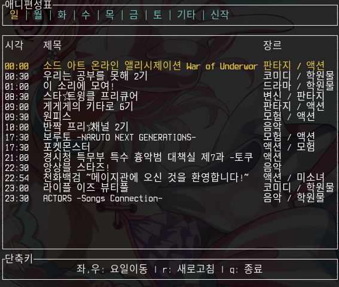

# Anitable-tui
[](https://crates.io/crates/anitable-tui)




## 필요
* rust nightly 버전 이상 (`rustc 1.41.0-nightly (412f43ac5 2019-11-24)`)

## 설치 및 실행
```bash
$ cargo install anitable-tui
$ anitable-tui
```

## 빌드
저장소를 클론하고 다음을 실행
```bash
$ cargo build
```

## 실행
```bash
$ cargo run
```

## License
MIT
